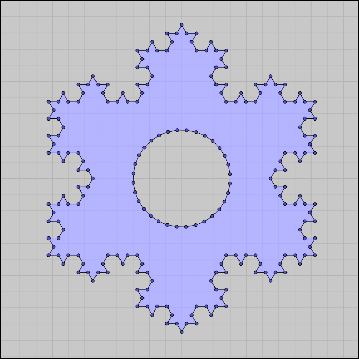

# CGALDotNet
C# wrapper for [CGAL](https://www.cgal.org/)

Some common geomerty objects are referrenced in a [seperate project](https://github.com/Scrawk/CGALDotNetGeometry) so they can come under a seperate license.

Work in progress. Only 64 bit windows binarys provided.

Examples in Unity can be found in [this](https://github.com/Scrawk/CGALDotNetUnity) repository.

